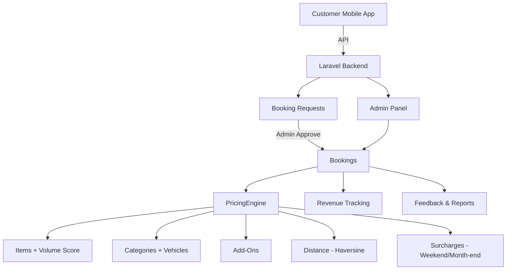

# 📘 ServiceHub Admin Panel — User Manual

> **Application:** ServiceHub (Bhanderi Packers & Movers)  
> **Type:** Laravel Web Admin Panel  
> **Purpose:** Packers & Movers Shifting Service — Booking, Pricing, Revenue, Customer & Master Data Management

---

## 📋 Sidebar Navigation Structure

```
├── 🏠 Main
│   └── Dashboard
│
├── 📦 Service Management
│   ├── Customers
│   ├── Bookings ▼
│   │   ├── Booking Requests
│   │   └── Booking Manage
│   └── Revenue
│
├── ⚙️ Master Management
│   └── Master Settings ▼
│       ├── Vehicles
│       ├── Categories
│       ├── Item Master
│       └── Add-On Services
│
├── 📊 Reports & Feedback
│   ├── Feedback & Ratings
│   └── Reports
│
├── 👥 Applications
│   └── User Management ▼
│       ├── Users
│       └── Roles & Permissions
│
└── 🔧 Settings
    └── System Settings ▼
        ├── General Settings
        ├── Pricing Settings
        └── Profile Settings
```

---

## 1. 🏠 Dashboard

| Detail | Info |
|---|---|
| **Route** | `/dashboard` |
| **Controller** | [DashboardController.php](file:///d:/ServiceHub/app/Http/Controllers/Backend/DashboardController.php) |
| **View** | `dashboard.blade.php` |

### क्या काम करता है:
- Admin panel का **main landing page** है
- Login के बाद सबसे पहले यही page खुलता है
- System की overall summary/stats दिखाता है
- Total Bookings, Pending Bookings, Completed Bookings जैसे quick cards show होते हैं

---

## 2. 👤 Customers

| Detail | Info |
|---|---|
| **Route** | `/customer` |
| **Controller** | [CustomerController.php](file:///d:/ServiceHub/app/Http/Controllers/Backend/CustomerController.php) |
| **View Folder** | `Backend/Customer/` |

### क्या काम करता है:
- **सभी customers की list** DataTable में दिखाता है (जिनका role "User" है)
- Customer की **profile photo, name, email, mobile, city, status** show होता है
- हर customer को **View, Edit, Delete** कर सकते हैं

### Features:
| Action | Description |
|---|---|
| **View (👁)** | Customer की booking history देखें |
| **Edit (✏️)** | Name, email, mobile, city, address, password, profile image update करें (Drawer में खुलता है) |
| **Delete (🗑)** | Customer को permanently delete करें |
| **Status** | Active / Inactive badge show होता है |

---

## 3. 📩 Booking Requests

| Detail | Info |
|---|---|
| **Route** | `/booking-request` |
| **Controller** | [BookingRequestController.php](file:///d:/ServiceHub/app/Http/Controllers/Backend/BookingRequestController.php) |
| **View Folder** | `Backend/BookingRequest/` |

### क्या काम करता है:
- **Mobile App से आई customer requests** यहाँ show होती हैं
- Customer जब app से shifting request भेजता है, वो यहाँ pending status में आती है
- Admin request को **Approve** या **Reject** कर सकता है

### Features:
| Action | Description |
|---|---|
| **View (👁)** | Request details drawer में देखें — customer, pickup/drop location, date, estimated amount |
| **Approve (✅)** | Request approve करने पर **automatic Booking create** हो जाती है (confirmed status) |
| **Reject (❌)** | Request reject कर दें |
| **Status** | Pending (🟡), Approved (🟢), Rejected (🔴) |

---

## 4. 📋 Booking Management

| Detail | Info |
|---|---|
| **Route** | `/booking` |
| **Controller** | [BookingController.php](file:///d:/ServiceHub/app/Http/Controllers/Backend/BookingController.php) |
| **View Folder** | `Backend/Booking/` |
| **Pricing Logic** | [PricingEngine.php](file:///d:/ServiceHub/app/Services/PricingEngine.php) |

### क्या काम करता है:
- **Booking system का core module** है — यहाँ सारी bookings manage होती हैं
- Admin manually **new booking create** कर सकता है
- **PricingEngine** automatic pricing calculate करता है

### Features:

| Action | Description |
|---|---|
| **List** | सभी bookings DataTable में — booking number, customer name, mobile, shifting date/time, amount, status |
| **Create (➕)** | New booking create करें — customer select (AJAX search), pickup/drop location, items select, add-ons, floor, date/time |
| **View (👁)** | Booking detail page — customer info, locations, items, add-ons, pricing breakdown, vehicle, category |
| **Edit (✏️)** | Booking update करें — items/addons बदलने पर pricing re-calculate होती है |
| **Cancel (❌)** | Booking cancel करें (status → cancelled) |
| **Complete (✅)** | Booking complete mark करें (status → completed) |

### Booking Statuses:
| Status | Color | Meaning |
|---|---|---|
| `pending` | 🟡 Warning | Booking बनी है, confirm नहीं हुई |
| `confirmed` | 🔵 Primary | Booking confirm हो गई |
| `in_progress` | 🔵 Info | Shifting चल रही है |
| `completed` | 🟢 Success | Shifting complete हो गई |
| `cancelled` | 🔴 Danger | Booking cancel कर दी गई |

### Auto Pricing (PricingEngine) कैसे काम करता है:

```
Step 1: Items का Volume Score calculate करो (item score × quantity)
Step 2: अगर total score > 310 → "Survey Required" (बहुत बड़ा shifting, manual quote)
Step 3: Volume Score से auto Category & Vehicle select करो
Step 4: Distance charges — Haversine formula से km calculate, first 5 km free, बाकी ₹20/km
Step 5: Add-On charges जोड़ो
Step 6: Floor charges (₹150/floor)
Step 7: Weekend surcharge (+10%) & Month-end surcharge (+15%)
Step 8: Grand Total = Base Fare + Distance + Addons + Floor + Weekend + Month-end
```

### Payment Breakdown:
- **Advance Amount** = Total का 20%
- **Remaining Amount** = Total - Advance
- **Vendor Commission** = Total का 15%
- **Vendor Settlement** = Total - Commission

---

## 5. 💰 Revenue

| Detail | Info |
|---|---|
| **Route** | `/admin/revenue` |
| **Controller** | [RevenueController.php](file:///d:/ServiceHub/app/Http/Controllers/Backend/Admin/RevenueController.php) |
| **View Folder** | `Backend/Admin/Revenue/` |

### क्या काम करता है:
- **Revenue tracking & payment overview** module है
- सभी bookings की payment status track करता है

### Features:
| Feature | Description |
|---|---|
| **Summary Cards** | Total Revenue, Advance Collected, Remaining Collected, Pending Revenue |
| **DataTable** | Booking number, customer, amount, advance, remaining, payment status, date |
| **Payment Status** | Fully Paid (🟢), Advance Paid (🟡), Unpaid (🔴) |

---

## 6. 🚛 Vehicles (Master)

| Detail | Info |
|---|---|
| **Route** | `/admin/vehicles` |
| **Controller** | [VehicleController.php](file:///d:/ServiceHub/app/Http/Controllers/Backend/Admin/VehicleController.php) |
| **View Folder** | `Backend/Admin/Vehicle/` |

### क्या काम करता है:
- **Shifting vehicles manage** करता है (Truck types: Mini Truck, Tata 407, Container, etc.)
- हर vehicle की **capacity score** define होती है
- PricingEngine booking बनाते वक़्त volume score के हिसाब से **auto vehicle assign** करता है

### Fields:
| Field | Description |
|---|---|
| `vehicle_name` | Vehicle का नाम (e.g., "Mini Truck", "Tata 407") |
| `vehicle_capacity_score` | Kitna load ले सकती है (integer score) |
| `status` | Active / Inactive |

### Actions: Create, Edit (Drawer), Delete

---

## 7. 📂 Categories (Master)

| Detail | Info |
|---|---|
| **Route** | `/admin/categories` |
| **Controller** | [CategoryController.php](file:///d:/ServiceHub/app/Http/Controllers/Backend/Admin/CategoryController.php) |
| **View Folder** | `Backend/Admin/Category/` |

### क्या काम करता है:
- **Shifting categories define** करता है (1 BHK, 2 BHK, 3 BHK, Office, etc.)
- हर category एक **vehicle से linked** है
- **Min/Max volume score range** set होता है — PricingEngine इसी से auto-select करता है

### Fields:
| Field | Description |
|---|---|
| `category_name` | Category का नाम (e.g., "1 BHK", "2 BHK", "Office Small") |
| `vehicle_id` | कौनसी vehicle use होगी (dropdown — active vehicles से) |
| `min_score` | Minimum volume score |
| `max_score` | Maximum volume score |
| `base_fare` | इस category का base fare (₹) |
| `status` | Active / Inactive |

### Actions: Create, Edit (Drawer), Delete

---

## 8. 📦 Item Master

| Detail | Info |
|---|---|
| **Route** | `/admin/items` |
| **Controller** | [ItemController.php](file:///d:/ServiceHub/app/Http/Controllers/Backend/Admin/ItemController.php) |
| **View Folder** | `Backend/Admin/Item/` |

### क्या काम करता है:
- **Shifting items define** करता है (Bed, Sofa, Fridge, Table, Washing Machine, etc.)
- हर item को **volume_score** assign होता है — booking create करते वक़्त items select करने पर total volume score calculate होता है
- Volume score से ही category और vehicle auto-decide होती है

### Fields:
| Field | Description |
|---|---|
| `item_name` | Item का नाम (e.g., "Double Bed", "Fridge", "Sofa 3-Seater") |
| `volume_score` | Item कितनी space लेता है (1 = छोटा, 3 = medium, 5 = बड़ा) |
| `status` | Active / Inactive |

### Actions: Create, Edit (Drawer), Delete

---

## 9. ➕ Add-On Services (Master)

| Detail | Info |
|---|---|
| **Route** | `/admin/addons` |
| **Controller** | [AddOnController.php](file:///d:/ServiceHub/app/Http/Controllers/Backend/Admin/AddOnController.php) |
| **View Folder** | `Backend/Admin/AddOn/` |

### क्या काम करता है:
- **Extra services define** करता है जो customer booking के साथ add कर सकता है
- जैसे: Packing, Unpacking, AC Shifting, Carpenter, Insurance, etc.
- Booking create/edit करते वक़्त इन्हें select करने पर **addon_charges** booking में add हो जाते हैं

### Fields:
| Field | Description |
|---|---|
| `addon_name` | Service का नाम (e.g., "Full Packing", "AC Shifting", "Carpenter") |
| `price` | Service की fixed price (₹) |
| `status` | Active / Inactive |

### Actions: Create, Edit (Drawer), Delete

---

## 10. ⭐ Feedback & Ratings

| Detail | Info |
|---|---|
| **Route** | `/admin/feedback` |
| **Controller** | [FeedbackController.php](file:///d:/ServiceHub/app/Http/Controllers/Backend/Admin/FeedbackController.php) |
| **View Folder** | `Backend/Admin/Feedback/` |

### क्या काम करता है:
- **Customer feedback/reviews देखने** का module है (Read-Only)
- Customer app से booking complete होने के बाद feedback देता है
- Admin यहाँ सारे feedback DataTable में देख सकता है

### DataTable Columns:
| Column | Description |
|---|---|
| Booking No. | कौनसी booking का feedback है |
| Customer Name | किस customer ने दिया |
| Rating Stars | 1-5 star rating (visual stars) |
| Comment | Customer का feedback text |
| Label | Excellent (4-5⭐), Average (3⭐), Poor (1-2⭐) |
| Date | कब feedback दिया |

---

## 11. 📊 Reports

| Detail | Info |
|---|---|
| **Route** | `/admin/reports` |
| **Controller** | [ReportController.php](file:///d:/ServiceHub/app/Http/Controllers/Backend/Admin/ReportController.php) |
| **View Folder** | `Backend/Admin/Report/` |

### क्या काम करता है:
- **Booking reports generate** करने का module है
- Date range और status filter लगाकर specific bookings देख सकते हैं

### Filters Available:
| Filter | Description |
|---|---|
| **From Date** | Shifting date "से" |
| **To Date** | Shifting date "तक" |
| **Status** | Specific status filter (Confirmed, Completed, Cancelled, etc.) |

### DataTable Columns:
| Column | Description |
|---|---|
| Customer Name | Customer का नाम |
| Amount | Booking amount (₹) |
| Status | Status badge (Confirmed, Completed, Cancelled, etc.) |

---

## 12. 👥 User Management

| Detail | Info |
|---|---|
| **Route** | `/user` |
| **Controller** | [UserController.php](file:///d:/ServiceHub/app/Http/Controllers/Backend/UserController.php) |
| **View Folder** | `Backend/User/` |

### क्या काम करता है:
- **System users (Admin, Staff, etc.) manage** करता है
- ये Customers से अलग है — यहाँ admin panel access वाले users हैं
- हर user को **Roles assign** कर सकते हैं (Spatie Permission)

### Features:
| Action | Description |
|---|---|
| **List** | सभी users — image, name, email, mobile, roles (badges), status, dates |
| **Create (➕)** | New user बनाएं — name, email, mobile, password, status, roles select |
| **Edit (✏️)** | User details update करें (Drawer में) |
| **Delete (🗑)** | User delete करें |

---

## 13. 🔐 Roles & Permissions

| Detail | Info |
|---|---|
| **Route** | `/role` |
| **Controller** | [RoleController.php](file:///d:/ServiceHub/app/Http/Controllers/Backend/RoleController.php) |
| **View Folder** | `Backend/Role/` |
| **Permission Config** | `config/PermissionModule.php` |

### क्या काम करता है:
- **Roles create/manage** करता है (e.g., Admin, Manager, Staff)
- हर role को specific **Permissions assign** कर सकते हैं
- `Admin` role delete नहीं हो सकता (protected)

### Features:
| Action | Description |
|---|---|
| **List** | सभी roles — name, permissions count |
| **Create (➕)** | New role बनाएं (unique name) |
| **Edit (✏️)** | Role name update (Drawer) |
| **Delete (🗑)** | Role delete (Admin role protected) |
| **Permissions (🔑)** | Module-wise permissions toggle (checkbox matrix) |

---

## 14. ⚙️ General Settings

| Detail | Info |
|---|---|
| **Route** | `/settings` |
| **Controller** | [SystemSettingController.php](file:///d:/ServiceHub/app/Http/Controllers/Backend/SystemSettingController.php) |
| **View** | `Backend/Settings/General` |

### क्या काम करता है:
- **System-level settings manage** करता है
- Logo, Favicon, और Footer text change कर सकते हैं
- Settings `settings` table में key-value pair format में store होती हैं

### Settings:
| Setting | Description |
|---|---|
| **Logo** | Sidebar logo image upload करें |
| **Favicon** | Browser tab favicon upload करें |
| **Footer Text** | Footer में दिखने वाला copyright text |

---

## 15. 💲 Pricing Settings

| Detail | Info |
|---|---|
| **Route** | `/admin/pricing` |
| **Controller** | [PricingController.php](file:///d:/ServiceHub/app/Http/Controllers/Backend/Admin/PricingController.php) |
| **View** | `Backend/Admin/Pricing/Index` |
| **Used By** | [PricingEngine.php](file:///d:/ServiceHub/app/Services/PricingEngine.php) |

### क्या काम करता है:
- **PricingEngine के configurable rates** set करता है
- ये values `pricing_settings` table में store होती हैं

### Configurable Settings:
| Key | Default | Description |
|---|---|---|
| `per_km_rate` | ₹20 | Extra distance charge per km (first 5 km free) |
| `per_floor_charge` | ₹150 | Floor carry charge (per floor without lift) |
| `weekend_surge_percentage` | 10% | Saturday/Sunday surcharge on (base + distance) |
| `month_end_surge_percentage` | 15% | Month-end (last 3 days + first 2 days) surcharge |
| `SURVEY_REQUIRED_THRESHOLD` | 310 | Volume score limit — इससे ऊपर manual survey required |

---

## 16. 👤 Profile Settings

| Detail | Info |
|---|---|
| **Route** | `/profile` |
| **Controller** | [ProfileController.php](file:///d:/ServiceHub/app/Http/Controllers/Backend/ProfileController.php) |
| **View** | `profile/edit` |

### क्या काम करता है:
- **Currently logged-in admin/user** अपनी profile update कर सकता है
- Profile image upload/remove कर सकता है
- Password change कर सकता है
- Account permanently delete कर सकता है

### Features:
| Action | Description |
|---|---|
| **Edit Profile** | Name, email, image update |
| **Change Password** | New password set करें |
| **Remove Image** | Profile photo हटाएं |
| **Delete Account** | Account permanently delete (password confirm required) |

---

## 🔗 API Endpoints (Mobile App)

Admin panel के साथ एक **Mobile App API** भी है जो customers के लिए है:

| Endpoint | Method | Description |
|---|---|---|
| `/api/check-mobile` | POST | Mobile number check करो (registered है या नहीं) |
| `/api/register` | POST | New customer register करो |
| `/api/verify-otp` | POST | | OTP verify करो
| `/api/resend-otp` | POST | OTP दोबारा भेजो |
| `/api/logout` | POST | Logout (auth required) |
| `/api/user` | GET | Current user details (auth required) |
| `/api/booking-requests` | GET | Customer की booking requests list (auth required) |
| `/api/booking-requests` | POST | New booking request create (auth required) |
| `/api/bookings` | GET | Customer की bookings list (auth required) |
| `/api/bookings/{id}` | GET | Booking detail देखो (auth required) |
| `/api/bookings/{id}/cancel` | POST | Booking cancel करो (auth required) |

---

## 📐 System Architecture Summary



---

## 📝 Key Models & Relationships

| Model | Table | Relationships |
|---|---|---|
| **User** | `users` | hasMany Bookings, has Roles (Spatie) |
| **Booking** | `bookings` | belongsTo Customer, Category, Vehicle; belongsToMany Items, AddOns; hasOne Feedback; hasMany Trackings |
| **BookingRequest** | `booking_requests` | belongsTo Customer |
| **Category** | `categories` | belongsTo Vehicle |
| **Vehicle** | `vehicles` | hasMany Categories |
| **Item** | `items` | belongsToMany Bookings |
| **AddOn** | `add_ons` | belongsToMany Bookings |
| **Feedback** | `feedbacks` | belongsTo Booking, Customer |
| **Setting** | `settings` | Key-Value store |
| **PricingSetting** | `pricing_settings` | Key-Value config |
| **OrderTracking** | `order_trackings` | belongsTo Booking |
| **OtpVerification** | `otp_verifications` | OTP management |

---

> **Total Modules: 16** (Dashboard + 15 Functional Modules)  
> **Tech Stack:** Laravel 11, Spatie Permission, Yajra DataTables, Bootstrap 5, Sanctum API Auth

---
==========================================================================================


## 🧭 Admin कैसे उपयोग करें (Quick Steps)


- **Dashboard (मुख्य पेज):**
    - Login करें → Sidebar से `Dashboard` खोलें.
    - ऊपर के summary cards से total bookings और pending/completed quickly देखें.

- **Booking Request Approve / Reject:**
    - Sidebar → `Bookings` या `Booking Requests` खोलें.
    - किसी request पर क्लिक करके detail drawer खोलें (customer, locations, items).
    - `Approve` दबाएँ → system में booking बन जाएगी; `Reject` दबाएँ यदि अस्वीकार करना हो.

- **New Booking Create (Admin से):**
    - Sidebar → `Bookings` → `Create New`.
    - Customer चुनें (search), pickup/drop location भरें.
    - `Items` add करें (quantity set करें) और `Add-Ons` चुनें यदि चाहिए.
    - Floors, shifting date/time डालें → `Calculate Price` (यदि button है) या Save करते समय backend PricingEngine लागू होगा.
    - Save → Booking बन जाएगा और `total_amount` दिखेगा; advance payment और vendor commission автоматически compute होते हैं.

- **Vehicle / Category / Item / Item Size / Add-On जोड़ना/बदलना:**
    - Sidebar → `Master Settings` → संबंधित module (Vehicles, Categories, Items, Item Sizes, Add-Ons).
    - `Create` पर क्लिक करें → फार्म भरें (नाम, score/value, status) → Save.
    - Edit करने के लिए row पर `Edit` और बदलाव करके Update करें.

- **Pricing Settings बदलना (Rates):**
    - Sidebar → `Pricing`.
    - Key (जैसे `per_km_rate`, `per_floor_charge`, `weekend_surge_percentage`) का मान बदलें और Save करें.
    - बदलने के बाद नई bookings या booking edits पर नया rate तुरंत प्रभावी होगा.

- **Pricing को verify / test करना:**
    - Admin → `Bookings` → नया booking बनाते समय विभिन्न items, addons, floors, और date/time बदलकर देखें.
    - या mobile-app वाले API endpoint `booking/ajax-pricing` (admin UI AJAX भी यही call करता है) से payload भेजकर breakdown लें.

- **Revenue देखना / भुगतान reconcile करना:**
    - Sidebar → `Revenue` खोलें.
    - Date filter लगाकर bookings देखें; हर booking की advance और remaining amount टेबल में दिखेगी.

- **Reports generate करना:**
    - Sidebar → `Reports` → from/to date और status select करें → `Apply` → Export/Print विकल्प देखें (यदि उपलब्ध).

- **User / Role management (Admin panel users):**
    - Sidebar → `Users` या `Roles`.
    - New admin/staff user बनाएं, Roles assign करें; Permissions matrix से module-level access control set करें.

- **Feedback देखना:**
    - Sidebar → `Feedback` → प्रत्येक feedback का comment, rating और booking link देखें; आवश्यक action लें.

---

## 💡 Pricing Calculation — सरल उदाहरण और formula

- Items example: `Sofa (score 5) x 1`, `Table (score 2) x 2` → Total volume score = 5 + 4 = 9.
- Category auto-select: यदि उस score के लिए `Category.base_fare = ₹1500` और `price_per_point = ₹50` तो

    - Base fare = 1500 + (9 × 50) = 1500 + 450 = ₹1950

- Distance: मान लें total_distance_km = 12 km और `per_km_rate` = ₹20 (first 5 km free)
    - Extra km = 12 − 5 = 7 → Distance charges = 7 × 20 = ₹140

- Add-Ons: अगर Packing addon = ₹500 → Addon charges = ₹500

- Floors: 2 floors × `per_floor_charge(150)` = ₹300

- Weekend surcharge (10% on base+distance): (1950 + 140) × 10% = ₹209

- Grand Total = 1950 + 140 + 500 + 300 + 209 = ₹3,099

- Advance (default 20%) = 3099 × 20% = ₹620 (approx)

इन values और percentages को आप `Pricing` page से configure कर सकते हैं; PricingEngine सभी steps का breakdown return करता है जिसे UI में दिखाई देता है।

---


